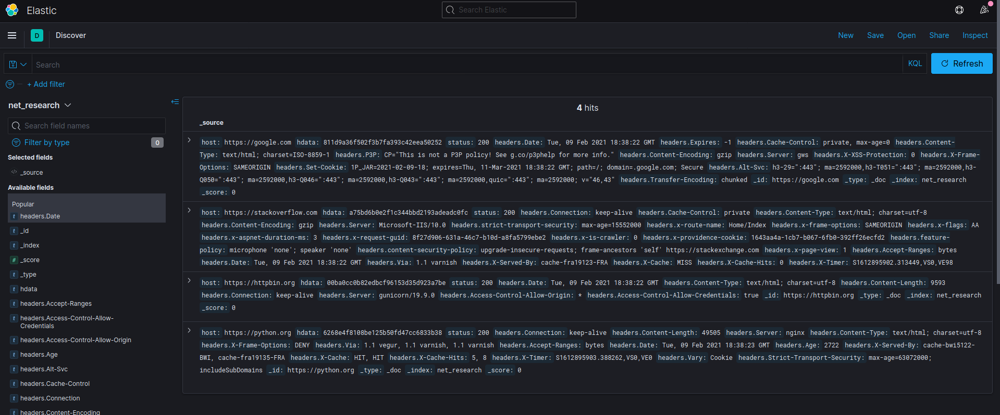

# net_research

# Задание
Собрать с пула адресов('https://google.com', 'https://python.org', 'https://stackoverflow.com', 'https://httpbin.org') 
следующую информацию: 
 - хэш содержимого корня
 - код ответа
 - заголовки

Собранную информацию отправить в elasticsearch

___
# Запуск

```sh
docker-compose up -d
firefox http://localhost:5601
```

# Остановка

```sh
docker-compose down -v --rmi local
```

